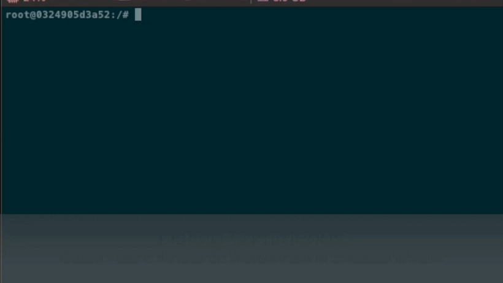

======
taccjm
======

TACC Job Manager is a lightweight python library for managing
HPC resources provided by the Texas Advanced Computing Center (TACC).

Description
===========

TACCJM manages ssh connections to TACC systems for deploying applications, running jobs, and downloading/uploading data. 
These connections to are maintained by a locally deployed server that exposes an API to access TACC connections via http endpoints.
This gives the user several methods to establish and maintain connections to TACC resources programmatically and without repeated 2-factor authentication.
Furthermore the application and job hierarchy makes it easier to create reproducible and shareable HPC workflows for research.

Requirements
============

Using taccjm requires a TACC account enable with 2-fa. In order to run jobs
on TACC systems as well, you will need a valid allocation associated with your user ID enabled. See the `TACC user portal <https://portal.tacc.utexas.edu/>`_

.. warning::

        TACC Job Manager allows you to programmatically access TACC resources.
        Please be responsible in your access and usage of TACC resources.
        Review the `TACC Usage Policy <https://portal.tacc.utexas.edu/tacc-usage-policy>`_ carefully before using any TACC resources.

Installation
============

To install use pip:

.. code-block:: shell

        pip install taccjm

Alternatively the `latest docker image <https://hub.docker.com/r/clos21/taccjm>`_ can be pulled using 

.. code-block:: shell

        docker pull clos21/taccjm

CLI
===

The easiest way to use TACC Job Manager is through the Command Line Interface (CLI). 

===

This project has been set up using PyScaffold 4.0.2. For details and usage
information on PyScaffold see https://pyscaffold.org/.
